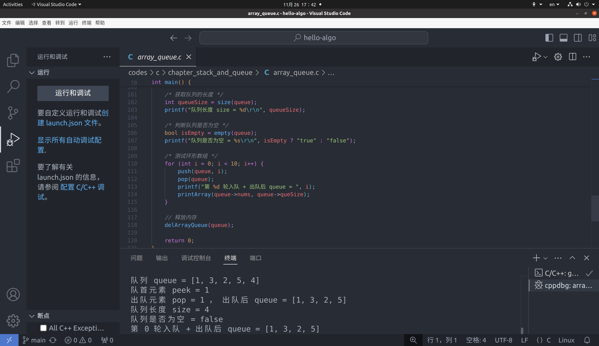

# 修改说明  

## 一、单向循环队列打印错误  

  
  
  如上图，应该出队的是元素 1 ，而实际输出的数组却仍然保留了元素 1  
  循环打印测试输出时也是错误的  
  
 ### **错误分析：**
  直接调用了笼统的数组打印函数，没考虑到这个循环队列的特殊情况，打印函数声明如下图：
  

 ### **修改后如下图：**
  
  

  ## 二、双向循环队列打印错误  

 ### **错误分析同上**

 ### **修改后如下图：**
 

 ### **修改方法**
 重新编写一个打印该特殊队列的函数！

